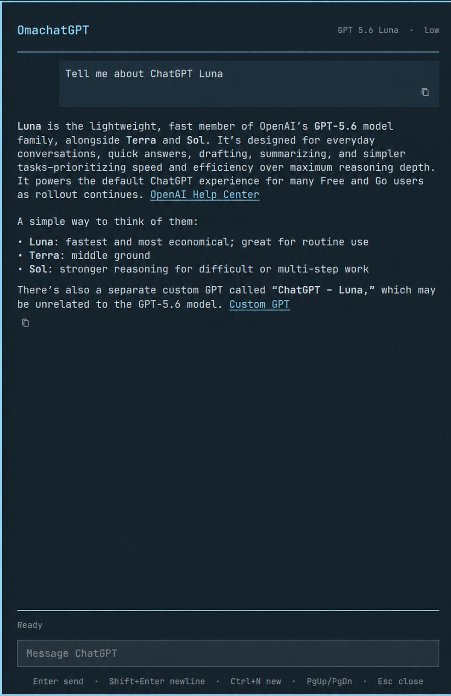

# OmachatGPT



OmachatGPT is a small, keyboard-first ChatGPT panel for Omarchy: summon it, ask
a question, and return to what you were doing without opening a browser or a
full coding-agent interface.

It uses the locally installed Codex CLI and the ChatGPT account already
authenticated by `codex login`. It does not require an OpenAI API key and has no
runtime npm dependencies.

## Features

- Fast native Omarchy Quattro panel that follows the active theme
- Warm backend for immediate reopen during short breaks
- Resumable conversation owned separately from normal Codex sessions
- Live web search with clickable source links
- Streaming prose with formatted links, lists, emphasis, code, and common math
- Expandable multiline composer and one-click message or code copying
- Deliberately no command execution, file access, plugins, skills, images, or
  coding-agent workflow

## Requirements

- Omarchy 4.0 or newer with Quattro shell plugin support
- Node.js 20 or newer on `PATH`
- A current Codex CLI with `app-server` support (tested with 0.152.1)
- Access to the `gpt-5.6-luna` model
- A ChatGPT-authenticated Codex login (`codex login status`)

Omarchy supplies the shell APIs and `omarchy-launch-browser` helper used by the
panel. Authentication, model access, usage limits, and web search are provided
by Codex and the user's ChatGPT account.

## Install

After the repository is published:

```bash
omarchy plugin add https://github.com/dpellerin/OmachatGPT.git --enable
omarchy-shell shell toggle dpellerin.omachatgpt '{}'
```

The plugin intentionally does not install a global shortcut or overwrite user
configuration. Bind the toggle command above to a key of your choice.

Update or remove it with Omarchy's standard plugin commands:

```bash
omarchy plugin update dpellerin.omachatgpt
omarchy plugin remove dpellerin.omachatgpt
```

Removing the plugin leaves its small state file and the conversation owned by
Codex intact. To remove only OmachatGPT's local state after uninstalling, run:

```bash
rm -f "${XDG_STATE_HOME:-$HOME/.local/state}/omachatgpt/state.json"
rmdir "${XDG_STATE_HOME:-$HOME/.local/state}/omachatgpt" 2>/dev/null || true
```

This does not remove Codex's separately managed conversation history. See
**Data and privacy** below.

## Keys

- `Enter`: send
- `Shift+Enter`: insert a newline
- `Esc`: stop an active response, otherwise close the panel
- `Ctrl+N`: start a new chat
- `PageUp` / `PageDown`: scroll

## Scope and safety

The Node bridge launches `codex app-server` with an empty, private runtime
directory, a read-only sandbox, approval disabled, MCP servers cleared, and all
available local-action features disabled. OpenAI-hosted web search is the only
tool exposed to the conversational model. Unexpected command, file-change,
browser-control, MCP, image, or agent events are interrupted and reported.

Links are restricted to `http` and `https` output and open through Omarchy's
browser launcher. Assistant HTML is escaped before display. Clipboard copying
uses Quickshell's native clipboard API, so message text is not placed in a
process argument or passed through a shell.

Like every Omarchy shell plugin, `Panel.qml` itself runs unsandboxed inside the
long-lived `omarchy-shell` process. Review third-party plugin source before
enabling it. Marketplace validation is not a security audit.

## What it runs and writes

| Component | Purpose | Access and persistence |
| --- | --- | --- |
| `Panel.qml` | Renders the Quattro panel | Runs inside `omarchy-shell`, as do all shell plugins. |
| `codex app-server --stdio` | Provides authenticated conversation streaming and live web search | Runs as a child process with a private temporary working directory, read-only sandbox, approvals disabled, MCP cleared, and local-action features disabled. |
| `omarchy-launch-browser` | Opens assistant links after an explicit click | Receives only validated `http` or `https` URLs. |
| `$XDG_STATE_HOME/omachatgpt/state.json` | Resumes the most recent OmachatGPT chat | Stores only the Codex thread ID, selected model, and update timestamp with owner-only permissions. |

The repository has no runtime npm dependencies. Its external requirements are
Omarchy/Quattro, Node.js, a current Codex CLI, and a ChatGPT-authenticated Codex
account. Codex app-server is an evolving integration surface; account access,
model availability, usage limits, and protocol compatibility can change between
Codex releases.

## Data and privacy

OmachatGPT writes a private state file containing only its Codex thread ID,
model name, and update timestamp:

```text
$XDG_STATE_HOME/omachatgpt/state.json
```

The fallback location is `~/.local/state/omachatgpt/state.json`, and the file is
created with mode `0600`. Codex separately persists the associated conversation
in its own local history so the chat can resume. Prompts, responses, and web
search requests are processed through the user's authenticated ChatGPT/Codex
service. OmachatGPT stores no API keys, passwords, tokens, analytics, or custom
telemetry.

Starting a new chat changes the saved thread ID; it does not erase prior Codex
history. Removing the plugin leaves both stores untouched. The state file may be
deleted manually after removal if the user no longer wants OmachatGPT to retain
its last thread reference.

## Limitations

- This is a focused text chat, not a replacement for ChatGPT or Codex.
- Images, attachments, voice, local files, and system context are unsupported.
- Math rendering is a lightweight readable formatter, not a complete TeX
  engine.
- The selected model must be available through the user's Codex account.
- Codex's experimental app-server protocol may require compatibility updates in
  future Codex releases.

## Development

Install the development tools and run the complete local verification suite:

```bash
pnpm install --frozen-lockfile
pnpm verify
pnpm smoke
```

`pnpm smoke` makes a real model request and uses account quota. The other checks
are local. The repository commits `dist/` because Omarchy's plugin installer
only clones and validates a plugin; it never runs package-manager or build
hooks.

For local development, link the checkout into the supported user plugin
directory:

```bash
ln -s "$PWD" ~/.config/omarchy/plugins/dpellerin.omachatgpt
omarchy-shell shell rescanPlugins
omarchy plugin enable dpellerin.omachatgpt
omarchy-shell shell toggle dpellerin.omachatgpt '{}'
```

The panel exposes non-sensitive latency counters for development checks:

```bash
omarchy-shell shell call dpellerin.omachatgpt metrics '{}'
```

The result reports cold starts, warm reopens, backend readiness, first-token
latency, total response time, and whether the five-minute warm backend is live.

## License

MIT
